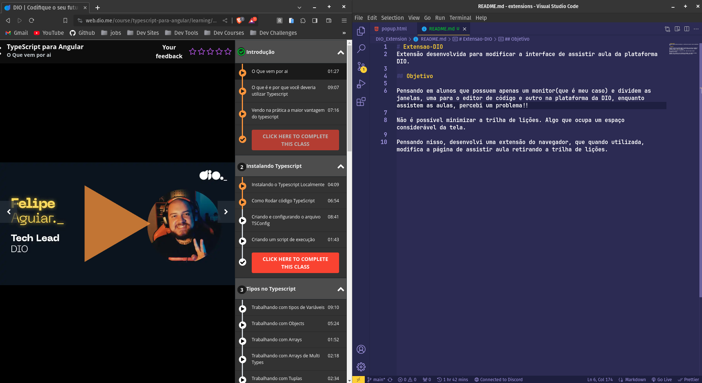

# Extensão para o site DIO
Extensão desenvolvida para modificar a interface de assistir aula da plataforma DIO.

## 🥅 Objetivo

Pensando em alunos que possuem apenas um monitor(que é meu caso) e dividem as janelas, uma para o editor de código e outro na plataforma da DIO, enquanto assistem as aulas, percebi um problema!! 

Não é possível minimizar a trilha de lições. Algo que ocupa um espaço considerável da tela.

  

Pensando nisso, desenvolvi uma extensão do navegador, que quando utilizada, modifica a página de assistir aula retirando a trilha de lições.

## 👨‍💻 Como-rodar-o-projeto

1. `git clone git@github.com:Felipe-dot/Extensao-DIO.git` -> Para clonar o repositório 

Para utilizar a extensão você precisa adiciona-la ao chrome utilizando o modo de desenvolvedor, você pode ver como fazer isso através [desse link](https://developer.chrome.com/docs/extensions/mv3/getstarted/development-basics/#load-unpacked).

## 🚀 Projeto-em-execução

  

## 📝 Licença

Esse projeto está sob a licença GNU. Veja o arquivo [LICENSE](LICENSE) para mais detalhes.

---

Feito com ♥ by Felipe Melo